# ADS Mundo Destinos

## Modo en que Hugo renderiza el sitio.

Hugo es un generador de sitios estaticos escrito en Go, un lenguaje de programacion creado por Google. Hugo utiliza el paquete "text/template" y "html/template" para rendenrizar el contenido y dejar a disposicion distintas funciones que permiten manipular este contenido.

Hugo como generador de sitios estaticos solo produce html que luego puede ser visto en un navegador web. No es un entorno de programacion, no tiene conciencia del contexto sobre el cual se esta ejecutando, por lo cual es solo un productor de html.

### Como Hugo carga los contenidos.

En el ambiente local de produccion, hugo dispone de un servidor que le permite al desarrollador tener un entorno de ejecucción en vivo para poder ver los cambios que introduce en su pagina.

Hugo esta pendiente de los cambios puestos en las carpetas *archetypes*, *content*, *data*, *layouts* y *static*. Cambios en estos directorios, se veran reflejados en el sitio si asi lo dispone quien este desarrollando.

### Página Home.

Los contenidos principales del home se cargan a traves del `index.html` que se encuentra en la carpeta `layouts`. De aqui Hugo saca los contenidos a renderar en el pagina principal. En este seccion se llaman a las distintas paginas, cargadas en un orden preestablecido, recorriendo la coleccion de paginas del tipo *destinos*.

Los logos presentes de los partners estan siendo cargados desde el directorio *data*, subdirectorio *hoteles*, archivo `hoteles_data.json`. A continuacion se presenta un ejemplo de la estructura del archivo:

```json
[
  {
    "nombre": "Iberostar",
    "img": "img/hoteles/hoteles_home/hotel1.jpg",
    "path": "hoteles/iberostar",
    "zonas": [
      {
        "nombre": "caribe",
        "path": "caribe.md",
        "destinos": [
          {
            "nombre": "bayahibe",
            "hoteles_destino": [
              {
                "nombre": "Iberostar Hacienda Dominicus",
                "imagen": "img/zonas/caribe/destinos/bayahibe/cadenas_hoteleras/iberostar/iberostar_hacienda_dominicus/principal_iberostar_hacienda_dominicus.jpg",
                "path": "hoteles_zonas/zona_caribe/iberostar/iberostar_hacienda_dominicus"
              }
            ]
          },
```

Esta coleccion de elementos sirve para cargar las imagenes presentes en el home de manera rapida y sencilla.

Existen imagenes dentro de esta seccion que corresponde solo a logos y no a cadenas hoteleras. Estos logos **existen** al interior del json que hemos indicado, pero a diferencia de las cadenas hoteleras, no tienen parametros, solo nombre e imagenes, por lo que, desde el home, no es posible ir hacia la paginas interiores de ellos. De todos modos, dado que hasta la fecha (8-2-2018) no se sabia si los logos iban o no a tener informacion al interior de las paginas, se opto tambien por crear los logos como contenido en hoteles. La razon es que, de esta manera es posible tener acceso sencillo, desde el punto de vista de los elementos dinamicos, a los logos que existen, y poder añadirle parametros al front matter, asi como poder discriminar si son o logos.

>**NOTA**: actualmente en los logos, al interior del front matter existe un parametro que indica si lo es. Esto se vera mas adelante, cuando veamos la pagina `destinos`.

### Pagina destinos.

En el recorrido *canonico* de la pagina, el siguiente nivel corresponde a los *destinos*. Esta seccion carga contenidos dinamicos asociados a todos los destinos por zona a la cual entramos. En efecto, si hacemos click en la zona **Caribe** o **Centroamerica**, se visualizan los cuadros de cada destino cargando el parcial `destinos.html`. Esto se hace satisfaciendo la siguiente condicion:

```html
<!-- NOTE: extracto del single de destinos -->
{{ range .Site.Pages }}
  {{ if eq .Params.type $data.Params.tipo_destino }}
    {{ partial "destinos.html" . }}
  {{ end }}
{{ end }}
```

El parcial de destinos tiene la siguiente estructura:

```html
<div class="col3">
  <div>
    <a href="{{ $.Site.BaseURL }}{{ .RelPermalink }}">
      
      <h3>{{ .Title }}</h3>
    </a>
  </div>
</div>
```

Cargando la url hacia el destino, la imagen asociada al destino y el titlo de este.

Posterior a esto se cargan los *partners* asociados a cada zona. Para poder cargar solo aquellos partners asociados a esa zona, primero se asigna a una variable local el titulo de la zona `$titulo` y luego se recorren los hoteles, guardando en distintas variables locales los siguientes parametros:

```html
{{ range where .Site.Pages "Section" "hoteles" }}
  {{ $es_logo := .Params.es_logo }}
  {{ $zonas := .Params.zonas_cadena }}
  {{ $nombre_cadena := .Title }}
  {{ $ruta := .Permalink }}
  {{ $imagen := .Params.img }}
  {{ range $zonas }}
    {{ if and (eq . $titulo) ($es_logo ) }}
      
    {{ else if eq . $titulo }}
      <a href="{{ $ruta }}"></a>
    {{ end }}
  {{ end }}
{{ end }}
```

Dado que los hoteles (o los logos), pueden estar en varias zonas, el parametro zonas constituye una coleccion de elementos, sobre las cuales hay que iterar, en orden de determinar si se pone o no la imagen del hotel o logo. Notar que se establece una condicional para saber si lo que vamos a poner es un hotel o un logo. En este caso todos los logos tienen el siguiente parametro en el front matter:

```yaml
---
title: "Air Canadá"
date: 2017-12-20T12:39:54-03:00
img: "img/hoteles/hoteles_home/hotel49.jpg"
url_zona: ["zonas/norteamerica/norteamerica"]
zonas_cadena: ["Norteamerica"]
draft: false
es_logo: true
---
```

Si la condicion se satisface, en vez de cargar un anchor, cargamos una imgen del logo.

### Pagina de destino (destino partiuclar).

A diferencia de la pagina destinos y el index, los destinos particulares son cargados segun el nombre del directorio, que mapea el destino. En este caso nosotros tenemos en nuestra carpeta content:

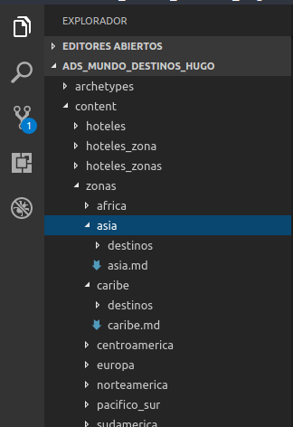

Al interior de este directorio, que esta nombrado en razon de las zonas que existen en la pagina, tenemos un archivo `.md` llamado Caribe que funcionan similar a los `_index.md` en contenidos que requieren de `list.html` y `single.html`. 

Al interior del directorio destinos, se encuentran todos los destinos asociados a esa zona como podemos ver en la imagen:

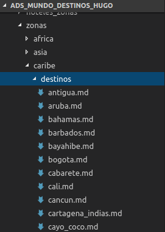

Notamos que estan los destinos asociados a la zona, que son posteriormnete cargados en las paginas de destino. 

Para poder ubicarse respecto a pagina corresponde a que plantilla podemos ver las urls que el navegador marca, con el servidor local corriendo:

Para el caso de la pagina que muestra todos los destinos por zona tenemos el siguiente esquema de url:

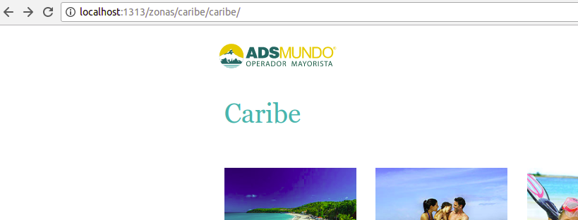

En la zona nortemerica tenemos un patron de url similar:

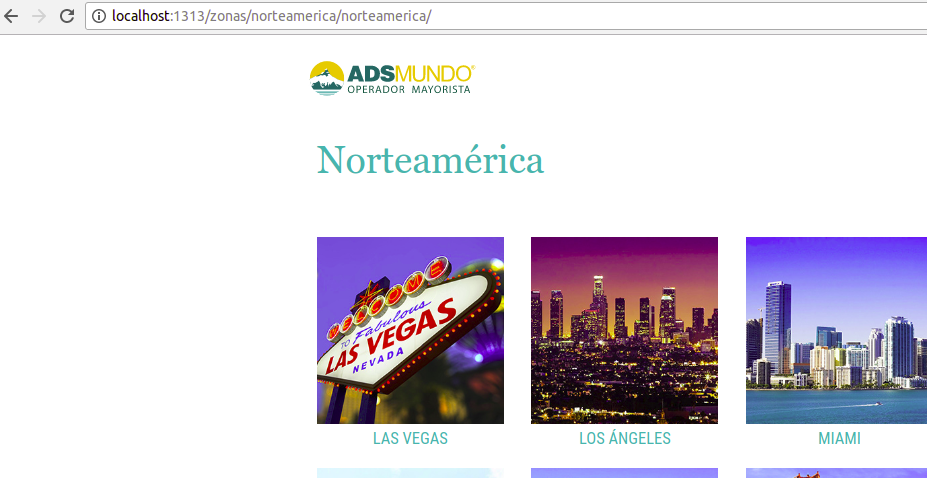

Por otro lado en el destino en especifico tenemos:

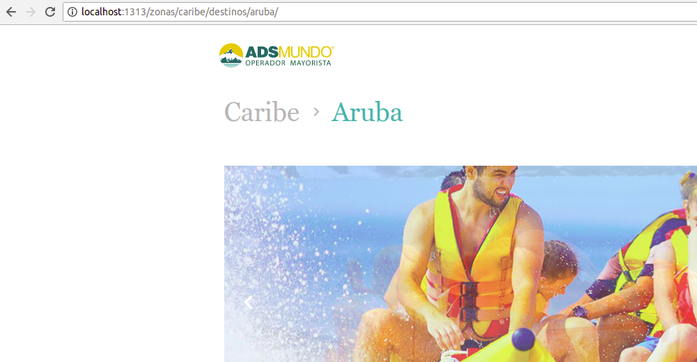

Teniendo en cuenta este patron de url podemos saber con certeza que plantillas de html modificar.

En el caso de las plantillas de destino, ya sea caribe, nortemarica, etc., nuevamente la seccion que presenta mayores complejidades tiene relacion con la carga de los partners asociados al destino. En este caso tenemos el siguiente codigo de hugo:

```html
<h2 class="full">Nuestros Partners</h2>
  <div class="flex">
    <!-- NOTE: los hoteles a lo cuales el destino pertenece son un arreglo que corresponde a los titulos de los hoteles en el directorio hoteles. Se los recorre, guardamos en variable en el scope, y comparamos. -->
    {{ $id_ruta_scroll := .Params.id_scroll_cadena }}
    {{ $isset_tiene_logo := isset .Params "tiene_logo" }}
    {{ $tiene_logo := .Params.tiene_logo }}
    {{ $zona := .Params.zona }}
    {{ $nombre_destino := lower .Title }}
    <!-- Si el parametro esta seteado significa que tiene logos, entonces cargar imagenes de logos sin url -->
    {{ if (isset .Params "hotel_pertenece")}}
      {{ range .Params.hotel_pertenece }}
        {{ $hotel := . }}
        {{ range where $.Site.Pages "Type" "hoteles" }}
          {{ if and (eq .Title $hotel) (ne .Title "Blue Travel")}}
            <a href="{{ $.Site.BaseURL }}{{ .RelPermalink }}#{{ $id_ruta_scroll }}">
              </a>
          <!-- NOTE: condicion especial requerida por el cliente para los hoteles Blue Travel -->
          {{ else if and (eq .Title $hotel) (eq .Title "Blue Travel") }}
              {{ $imagen := .Params.img }}
              {{ $hotel_blue := index (where $.Site.Data.hoteles.hoteles_data "nombre" "Blue Travel") }}
              {{ range $hotel_blue }}
                {{ $zonas := .zonas }}
                {{ range $zonas }}
                  {{ if eq .nombre (lower $zona) }}
                    {{ range .destinos }}
                      {{ if eq .nombre $nombre_destino }}
                        {{ range .hoteles_destino }}
                          <a href="{{ $.Site.BaseURL }}{{ .path }}">
                            </a>
                        {{ end }}
                      {{ end }}
                    {{ end }}
                  {{ end }}
                {{ end }}
              {{ end }}
          {{ end }}
        {{ end }}
      {{ end }}  
    {{ end }}
    {{ if and $isset_tiene_logo $tiene_logo }}
      {{ $logos_collec := .Params.logos_collec }}
      {{ range $logos_collec }}
        {{ $logo := . }}
        {{ range where $.Site.Pages "Type" "hoteles" }}
          {{ if and (eq .Title $logo) (eq $isset_tiene_logo true) }}
            <a href="">
              
            </a>
          {{ end }}
        {{ end }}
      {{ end }}
    {{ end }}
  </div>
```

#### Explicacion del codigo.

Debido a diferentes requerimientos, esta seccion tuvo que adaptarse a mostrar tanto las imagenes de los hoteles, como de los logos de ciertos productos. Es porque esto que inicialmente, se setean una serie de variables locales relevantes para el caso de los logos de hoteles:

```html
{{ $id_ruta_scroll := .Params.id_scroll_cadena }}
{{ $isset_tiene_logo := isset .Params "tiene_logo" }}
{{ $tiene_logo := .Params.tiene_logo }}
{{ $zona := .Params.zona }}
{{ $nombre_destino := lower .Title }}
```

**$id_ruta_scroll** corresponde al id del hotel que debe mostrarse cuando se hace click:

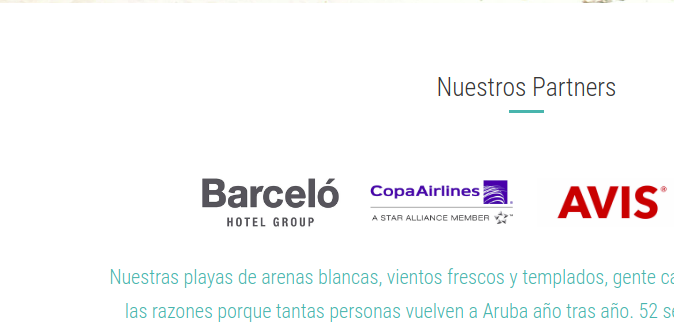

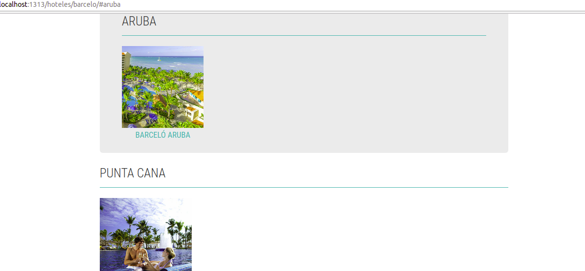

Notar la url con el # y el estilo aplicado (mediante javascript).

**$isset_tiene_log** determina si el parametro existe o esta seteado y posteriormente con **$tiene_logo** tomamos el valor del parametro. 

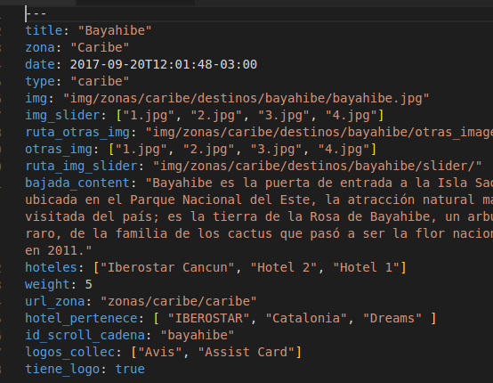

Finalmente peidmos la zona y el nombre del destino. Recorremos los hoteles a los cuales pertenece el destino, luego de verificar que el parametro **hotel_pertenece** existe. Al interior del recorrido, tomamos cada hotel que podria estar en la coleccion, y lo asociamos a la variable local **$hotel**. 

```html
{{ range .Params.hotel_pertenece }}
  {{ $hotel := . }}
```

Volvemos nuevamente a iterar esta vez sobre las paginas del sitio que sean de tipo "hoteles". Aca es cuando efectuamos una comparacion fundamental, entre el titulo de las paginas que estamos iterando, y el nombre del hotel almacenado en la variable local **$hotel**. Si la condicion es satisfecha y no es el hotel *Blue Travel*, entonces se renderiza un anchor tag con los datos asociados a la imagen del logo y la ruta correspondiente a la cadena del hotel. 

```html
{ if and (eq .Title $hotel) (ne .Title "Blue Travel")}}
  <a href="{{ $.Site.BaseURL }}{{ .RelPermalink }}#{{ $id_ruta_scroll }}">
    </a>
```

Si se da el caso, de que el hotel recorrido es efectivamente Blue Travel, entonces se atiende a la condicion especial puesta. 

Primero guardamos en dos variables locales los parametros de la imagen del logo y el objeto correspondiente al hotel.

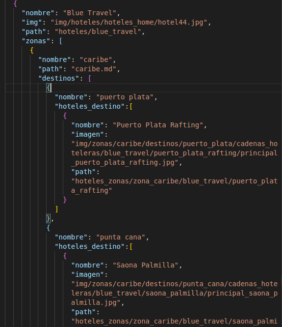

 Al obtener esta suerte de objeto, podemos recorrerlo. El objetivo es satisfacer el requerimiento que indica que, para el caso del hotel blue, queremos ir directamente a la ficha del hotel, para lo cual comparamos el nombre del destino (**$nombre_destino**), con el nombre de la zona, y de existir coincidencia, recorremos la coleccion de hoteles del destino, y cargamos un anchor tag con los parametros del hotel de destino. 

 El resultado se ve a continuacion, primero hacemos click en el logo de Blue Travel:

 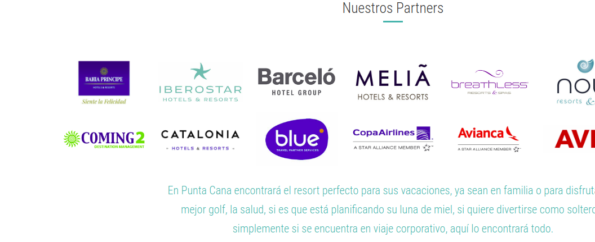

 Lo cual nos lleva como resultado a la ficha correspondiente a ese destino:

 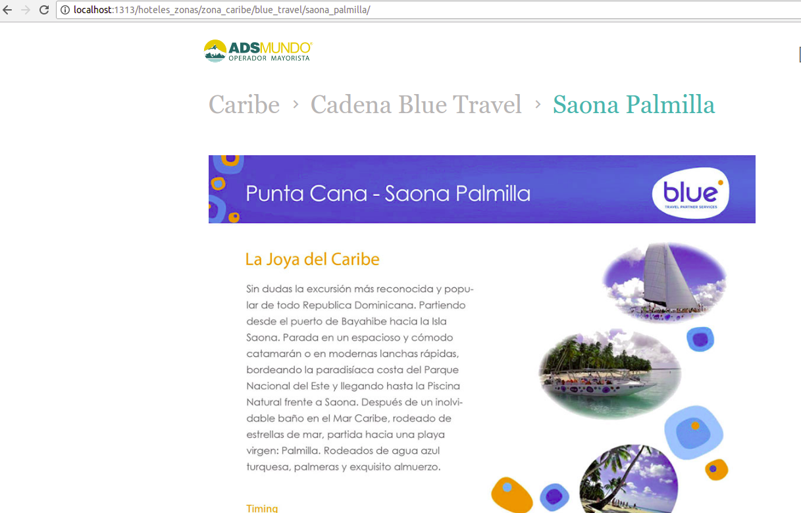

 > **NOTE**: el requerimiento alusivo a Blue Travel fue especifico, y por lo mismo se impuso una condicion especial con un recorrido especial para poder atender a tal requerimiento

Luego del establecimiento de esta condicion, verificamos si el parametro **$isset_tiene_logo** y **$tiene_logo** son verdaderos, y si es asi, recorremos la colecion de logos del destino y ponemos las imagenes de estos:

```html
{{ if and $isset_tiene_logo $tiene_logo }}
  {{ $logos_collec := .Params.logos_collec }}
  {{ range $logos_collec }}
    {{ $logo := . }}
    {{ range where $.Site.Pages "Type" "hoteles" }}
      {{ if and (eq .Title $logo) (eq $isset_tiene_logo true) }}
        <a href="">
          
        </a>
      {{ end }}
    {{ end }}
  {{ end }}
{{ end }}
```
El resto de la pagina carga los contenidos e imagenes que obtiene de los parametros del destino.

### Pagina hoteles.

La pagina hoteles corresponde al cuarto nivel de navegacion, siguiendo la siguiente ruta `home -> zonas -> zonas/nombre_de_la_zona -> hoteles/nombre_cadena`. En esta pagina se cargan los hoteles que existen por cadena.

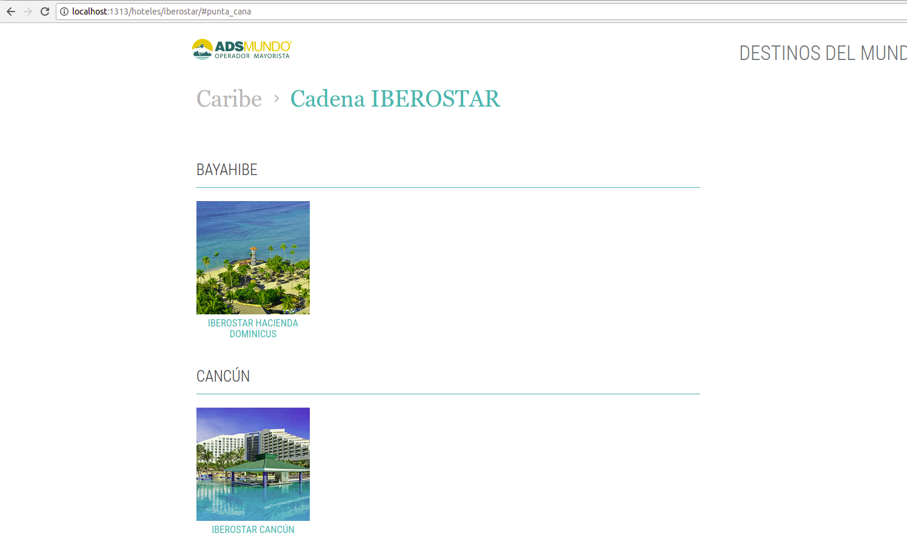

Primero se imprime la zona en la cual está la cadena realizando el siguiente recorrido:

```html
 {{ $url_zonas := .Params.url_zona }}
  {{ if ne $nombreHotel "Decameron" }}
    {{ range .Params.zonas_cadena }}
      {{ $zona := . }}
      {{ range $url_zonas }}
        <a href="{{ $.Site.BaseURL }}{{ . }}" class="breadcrumb">{{ $zona }}</a>
      {{ end }}
    {{ end }}
  {{ end }}
  <a href="#!" class="breadcrumb">Cadena {{ .Title }}</a>
```
>**NOTE**: por el momento las cadenas hoteleras (y no los logos) se encuentran en una sola zona, por lo que esta solucion satisface el requerimiento de navegacion de los breadcrumbs. No obstante, si las cadenas hoteleras llegaran a pertenecer, como puede pasar, a varias zonas, aca tendriamos impreso una serie de zonas como para en el caso de los logos. Este es un tema que debe resolverse a posteriori cuando los contenidos cargados permitan tener la instancia de cadenas hoteleras en varias zonas.

Luego de esto, obtenemos en una coleccion llamada **$hoteles** los datos del json **hoteles_data**, e iteramos sobre las paginas tal como lo vemos en este extracto:

```html
 {{ $hoteles := .Site.Data.hoteles.hoteles_data }}
  {{ range $.Site.Pages }}
    {{ $titulo := .Title }}
    {{ $zona := lower .Params.zona }}
```

Guardamos en variables **$titulo** y **$zona** correspondiente a los parametros que estamos obteniendo, e iteramos sobre el parametro **hotel_pertenece** de existir. Si esto es asi, entonces tendremos almacenado en una variable local el nombre del hotel de destino. Efectuando la comparacion hacemos:

```html
{{ if eq $nombreHotel $hotel_destino }}
  <div class="destino-{{ $id_scroll_cadena }}" id="destino">
    <h2 id="{{ $id_scroll_cadena }}" class="borderBottom">{{ $titulo }}</h2>
    <!--NOTE: aca se cargan los datos correspondientes a los hoteles POR destino. Estos datos son el nombre del hotel y su imagen correspondiente -->
    {{ range $hoteles }}
      {{ if eq (lower .nombre) ( lower $nombreHotel) }}
        {{ range .zonas }}
          {{ $nombre_zona := .nombre }}
          <!-- NOTE: -->
          {{ if eq $zona $nombre_zona }}
            {{ range .destinos }}
              {{ if eq (lower $titulo) .nombre }}
                <div class="flex flexJustStart">
                  {{ range .hoteles_destino }}
                    <div class="col3">
                      <a href="{{ $.Site.BaseURL }}{{ .path }}">
                      
                      <h3>{{ .nombre }}</h3>
                      </a>
                    </div>
                  {{ end }}
                </div>
              {{ end }}
            {{ end }}
          {{ end }}
        {{ end }}
      {{ end }}
    {{ end }}
    </div>
  {{ end }}
```

Recorremos los hoteles que obtuvimos y guardamos en la variable local, comparamos el nombre del hotel con el nombre actual de la cadena, iteramos sobre las zonas, que son como se muestra en la imagen:

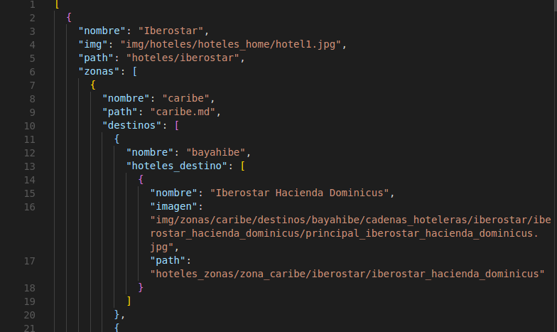

Obtenemos el nombre de la zona, y recorremos los destinos. Comparamos que el titulo de la pagina sobre la cual estamos sea igual al nombre del destino que estamos recorriendo, en cuyo caso recorremos los hoteles del destino, para poner la imagen y el nombre del hotel:

```html
{{ range .hoteles_destino }}
  <div class="col3">
    <a href="{{ $.Site.BaseURL }}{{ .path }}">
    
    <h3>{{ .nombre }}</h3>
    </a>
  </div>
  {{ end }}
```

### Pagina hoteles_zonas

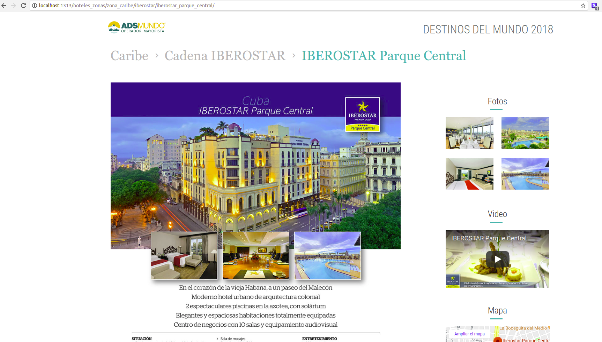

Esta pagina corresponde al ultimo lugar al cual se accede siguiendo el recorrido canonico que la pagina deberia tener. Aca se muestran los datos asociados al hotel, que se relacion con el destino. Tambien se pueden descargar documentos, fichas, y ver videos. 

La unica complicacion que existe en esta pagina, es el script asociado que carga los videos de youtube usando la API de esta. 

Para esto creamos un script que crea otro elemento de script que require los datos de la API de youtube. Luego se inicializa el player de video, usando el ejemplo existente en la pagina de la api de youtube.

```js
function onYouTubeIframeAPIReady(){
  player = new YT.Player('player', {
    height: '100%',
    width: '100%',
    videoId: id_video
  })
}

function stopVideo(){
  player.stopVideo();
}
function simplePlay(){
  player.playVideo();
}
```


### Uso de partials.

Los **partials** corresponden a fragmentos de html que pueden ser cargados en cualquier pagina siguiendo la convencion `{{ partial "ruta_del_parcial/nombre_del_parcial.html" . }}`. Si se inspeccionan se verá que son archivos html basicos con elementos propios de Hugo para mostrar el contenido. La funcion del parcial es poder abstraer estructuras de html que se reiteran continuamente, pudiendo llamar siempre al mismo fragmento de html, sin tener que escribirlo varias veces.

Los parciales se encuentran en el directorio `layouts/partials`. Usualmente queremos pasarle el contexto a un parcial. Esto es, queremos que el parcial tambien tenga presente las variables globales y locales de la plantilla html que se este cargando. Es por esto que incluimos, luego de la llamada al parcial mediante su ruta, el punto como aca:

`{{ partial "ruta_del_parcial/nombre_del_parcial.html" . }}`

La inclusion del punto al final de la llamada al parcial permite que al interior del parcial podamos acceder a variables como `{{ .Title }}`, como vemos en el siguiente fragmento de codigo:

```html
<!-- NOTE: extracto del parcial destinos -->
<div class="col3">
  <div>
    <a href="{{ $.Site.BaseURL }}{{ .RelPermalink }}">
      
      <h3>{{ .Title }}</h3>
    </a>
  </div>
</div>
``` 

Notar que si bien este parcial se encuentra en el directorio de parciales, puede perfectamente acceder a las variables locales asociadas a cada destino.

### Detalles relativos a la compilacion.

Finalmente para generar el sitio, debemos compilarlo. Si tenemos scripts de lado servidor (scripts de php), estos no funcionan con el servidor local del hugo, por lo que cualquier llamada ajax que se ese efectuando desde el javascript detectado en el directorio static, no funcionara. Para esto podemos compilar el sitio, usando el comando 

```bash
hugo server
```
Una vez compilado tendremos a nuestra disposicion el directorio en el directorio `public` el sitio listo, con la url que le hemos dado en el `config.toml`, como podemos ver en la imagen:

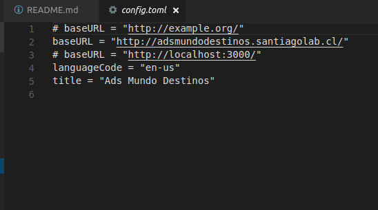

En el parametro **baseURL** tenemos lo necesario para configurar la url, que sera la que tendra los elementos internos del sitio y que nos permitiran ver bien el sitio una vez que lo subamos al subdominio.

Si uno desea hacer pruebas de backend -como probar scripts alusivos a formularios, etc- el **baseURL** puede ser *http://localhost:3000/*, lo cual nos permitiria usar el servidor local de php para poder hacer las pruebas, teniendo el sitio ya compilado, en una suerte de simulacion de lo que seria el sitio subido al subdominio, tal cual aparece en la imagen tambien.

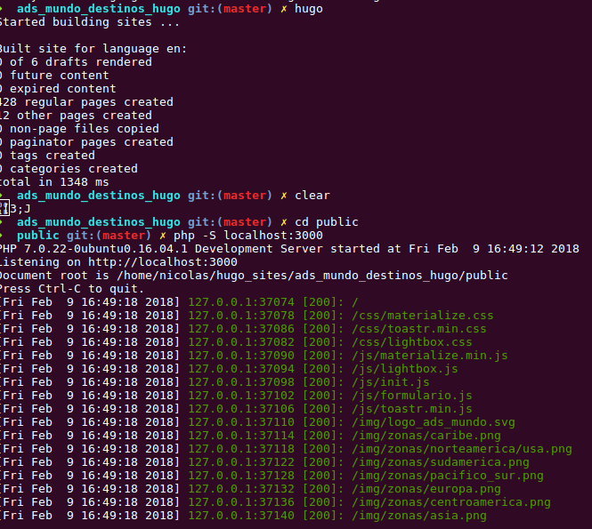